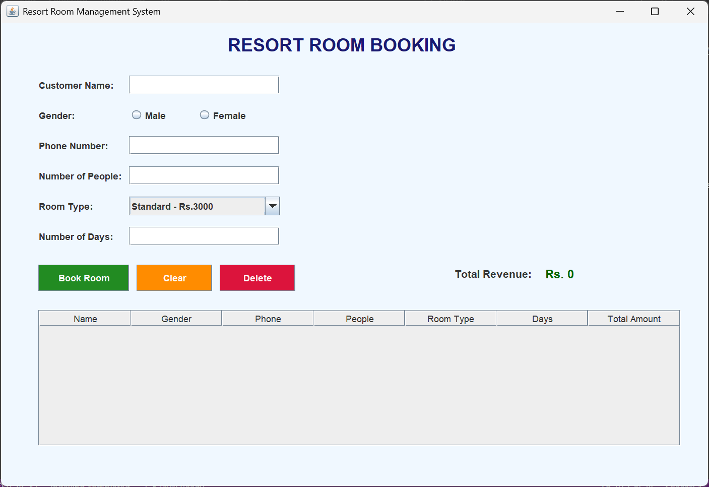

# Resort Room Management System (Java Swing)

A desktop application built using **Java Swing** for managing resort room bookings.  
The system allows users to enter customer details, select room types, manage bookings, and automatically calculate total revenue.

---

## Features

- GUI built using **Java Swing**
- Customer booking management
- Gender selection using radio buttons
- Room type selection (Standard, Deluxe, Premium, Suite)
- Booking duration and number of guests input
- Automatic total cost calculation
- Booking records displayed using **JTable**
- Delete selected booking
- Dynamic total revenue calculation
- Input validation with dialog messages

---

## Technologies Used

- Java
- Java Swing (GUI)
- AWT Event Handling
- JTable and DefaultTableModel

---

## Room Pricing

| Room Type | Price Per Day |
|-----------|---------------|
| Standard  | Rs. 3000 |
| Deluxe    | Rs. 5000 |
| Premium   | Rs. 6500 |
| Suite     | Rs. 8000 |

---

## How It Works

1. Enter customer details such as name, gender, phone number, and number of guests.
2. Select the room type and number of days for the stay.
3. Click **Book Room** to add the booking to the table.
4. The system automatically calculates the total cost.
5. All bookings are displayed in a table.
6. The **Delete** button removes a selected booking.
7. The **Total Revenue** field updates automatically.

---

## Application Screenshot


## Running the Project

### Compile

```bash
javac ResortRoomManagementSystem.java
